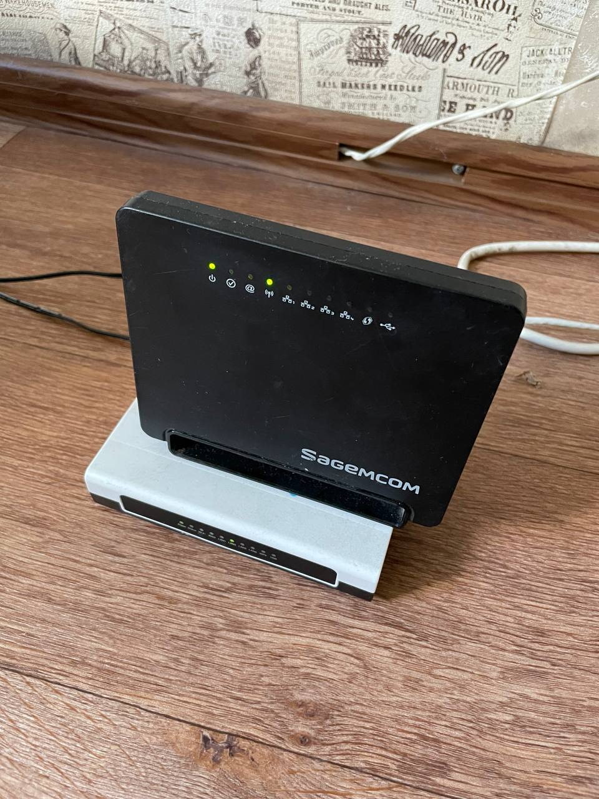

# Youtube Stalker Bot

В данной ветке представлен код, который запущен на моём [старом роутере](https://openwrt.org/toh/hwdata/sagem/sagem_fast2704n_v1) Sagecom, который выступает в качестве сервера для https://t.me/youtubestalkerbot.



## Компиляция
### Linux
1. `env GOOS=linux GOARCH=mips GOMIPS=softfloat  go build -trimpath -ldflags="-s -w" .`
2. `upx -9 youtube-stalker-bot`

# Windows
```cmd
set GOOS=linux
set GOARCH=mips
set GOMIPS=softfloat
go build -trimpath -ldflags="-s -w" .
```


